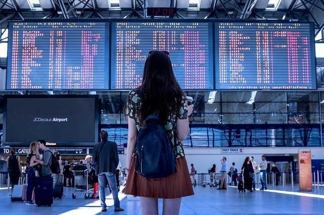
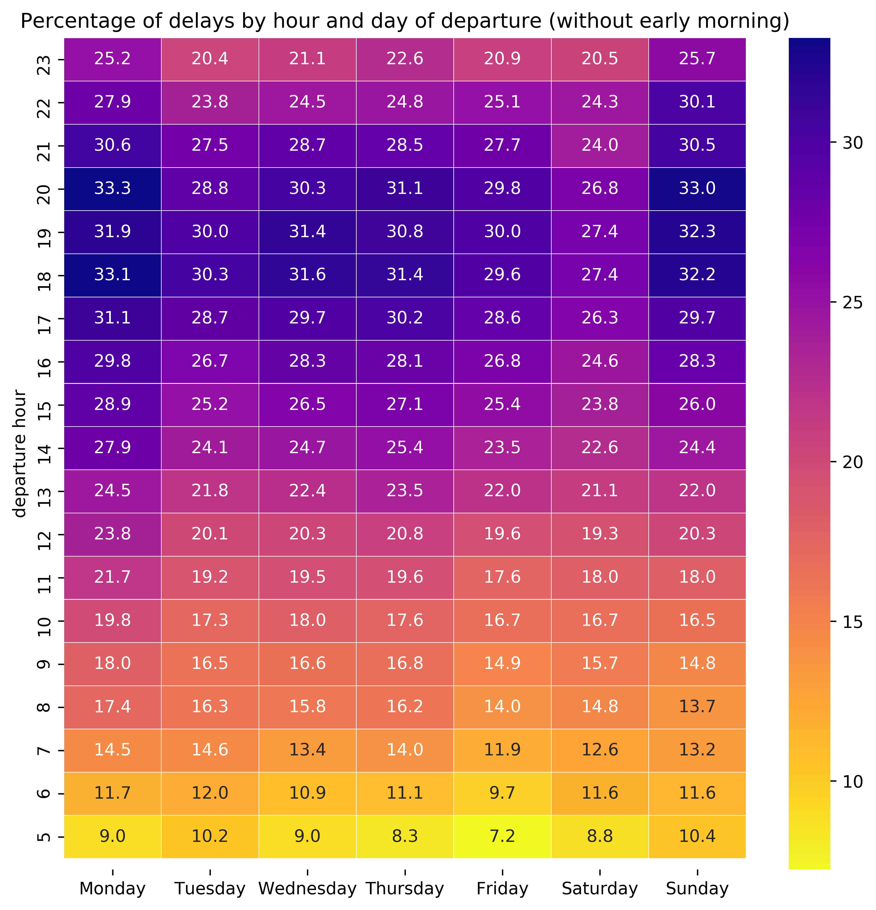

# Flight delays in 2009 and 2019 in USA

## by Kamila Hamalcikova

## Dataset

> My dataset contains information about flight delays in US on months of July and December of 2009 and 2019. The dataset contains nearly 2 400 thousand different delays and their attributes including airline, origin and destination airport, date, departure time, delay reasons etc. It was downloaded from [Bureau of Transportation Statistics](https://www.transtats.bts.gov/DL_SelectFields.asp). I was interested only in delay statistics, so I removed flights that were either cancelled or diverted.

## Summary of Findings

> In the exploration, I found out that suprisingly most flights arrive to their final destination ahead of schedule. Almost 58 % planes arrived at least 1 minute earlier, but I focused on flights with significant delay (15 minutes and more) which represented 22 % of all flights from selected period.

> Key finding from analysis is relationship between scheduled departure time and occurrence of delay of flights. Even though most flights take off from 06:00 to 06:59 and with each hour later there is usually less flights, **morning departure times has the lowest percentages of delayed flights, while this percentage steadily increase during the day to peak around 18:00 - 21:00**.

>This pattern is clear also when looking on scheduled departure time and average delay in minutes per hour. **Mornings from 05:00 to 07:59 have the shortest average delays (10 to 15 minutes), late evenings from 18:00 to 20:59 are the worst time, reaching around 30 minutes of delay on their arrival**. When different days of week are added to the picture, delays happen most often and for longer time on Mondays and Sundays. Best day to avoid delays is Saturday. Relationship between delays and departure hour or day will be the center of my explanatory presentation.

> When comparing percentage of delays for 22 airlines, I observed that **average percentage of delayed flights per airline is 22,61 %**. Big companies tend to fluctuate around this average, while very small airlines can be on either extreme of rankings. This percentage does not vary much over time. Difference between 2009 and 2019 for an airline was on average almost +/-3 percent points.

> I assumed that longer distance of flights will be associated with longer delays, but data showed not relationship with delays and flight distance or air time. This stayed true even after removing outliers for flights with very long distances (from and to Hawaii). From 24 biggest airports, we could see that the highest percentage of delayed flights were experience by people arriving to Newark airport in New Jersey and to New York or Fort Lauderdale. Delays bother the least passangers landing in Seatte or San Diego.

> I also found out that most common delay reasons were national aviation system delay, carrier and late aircraft delay. All appearing on more than 10 % of flights, while weather delays and security delays happened very rarely.

## Key Insights for Presentation

> In my presentation I will focus on effect of departure time (hour of day, day of week) on occurrence of delays. First, I will start with distribution of flights during day and week shown on simple and comprehensible bar charts. Later I will shown best and worst times to avoid delay on heatmap. I will use already polished version where early morning hours were removed because only very little flights do happen from midnight till 4:59 in comparison to much more busy departure times from 05:00 till 22:59.

## List of sources
- [Bureau of Transportation Statistics](https://www.transtats.bts.gov/Fields.asp)
- [Stackoverflow (for saving timedeltas and datetimes)](https://stackoverflow.com/questions/43487841/loose-timedelta-format-when-i-export-to-csv-is-there-a-solution)
- [Stackoverflow (for displaying annotations in bar charts)](https://stackoverflow.com/questions/31749448/how-to-add-percentages-on-top-of-bars-in-seaborn)
- [Stackoverflow (for hiding axis in Seaborn)](https://stackoverflow.com/questions/24497172/remove-yaxis-values-from-facetgrid-in-seaborn)
- [Stackoverflow (for customization of heatmap display)](https://stackoverflow.com/questions/56942670/matplotlib-seaborn-first-and-last-row-cut-in-half-of-heatmap-plot)
